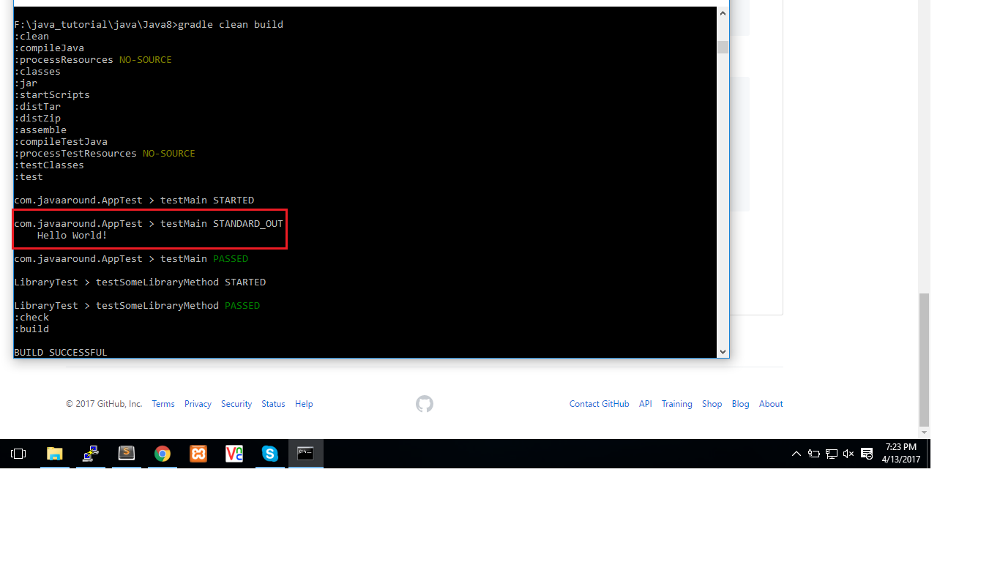

### Java 8 ###

Java 8 provided some great feature .it is released 8 March 2014<br/>

1. New Date Time api(javax.time)
2. Lambda Expression

### Warmup ###

1. create a directory

	`mkdir java8`

2. go to java8 directoy and apply `gradle init` command to create java project

	`gradle init --type java-application`

3.  Create App.java at src/main/java/com/javaaround	

	```java
	package com.javaaround;

	public class App {
	   public static void main( String[] args ){
	      System.out.println( "Hello World!" );
	   }
	}
	```
4. 	Create AppTest.java at src/main/test/com/javaaround	

	```java
	package com.javaaround;
	import org.junit.Test;

	public class AppTest {
	    @Test 
	    public void testMain() {
	        App.main(null);
	    }	
	   
	}
	```
5. Gradle default test output at $project_home/builds/reports/tests/index.html. We need also standard out at console . To do that add below line at build.gradle

	```java
	test {

		//we want display the following test events
	    testLogging {
	    	showStandardStreams = true
	        events "PASSED", "STARTED", "FAILED", "SKIPPED"
	    }
	}
	```	
6. if you need to run app from package file($builds\libs\java8.jar) by "java -jar" then 	add below line at build.gradle

	```java
	// Define the main class for the application
	mainClassName = 'com.javaaround.App'

	jar {
	   manifest {
	      attributes 'Main-Class': 'com.javaaround.App'
	   }
	}

	```
7. Run app by following command

	`gradle clean bulid`

 		